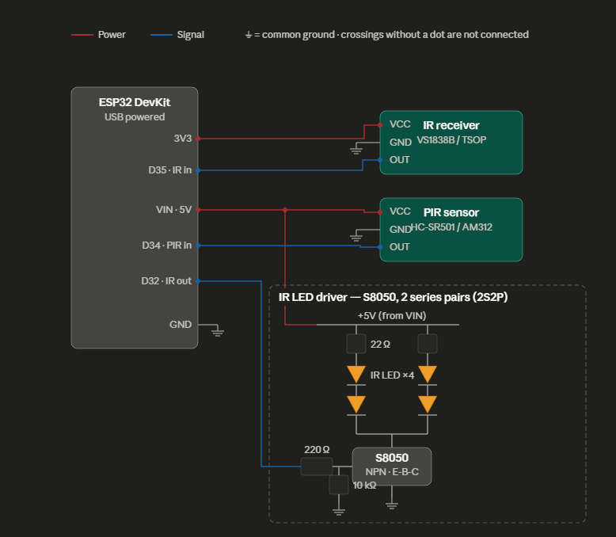
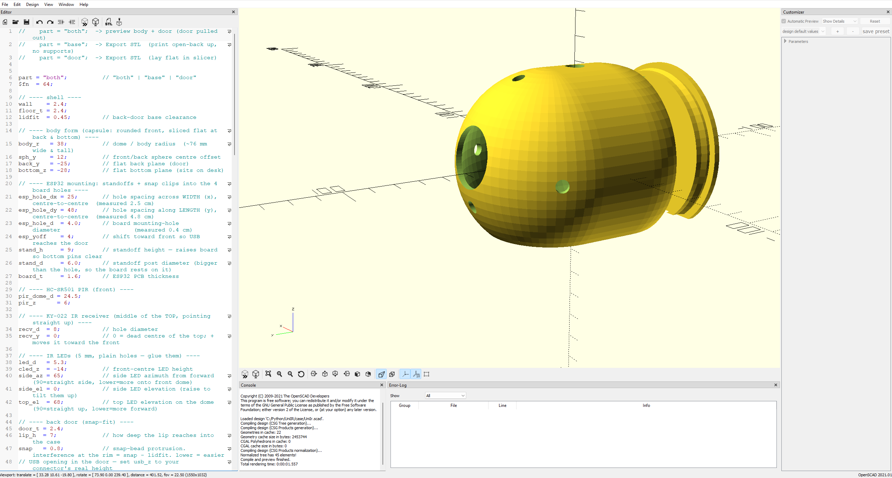
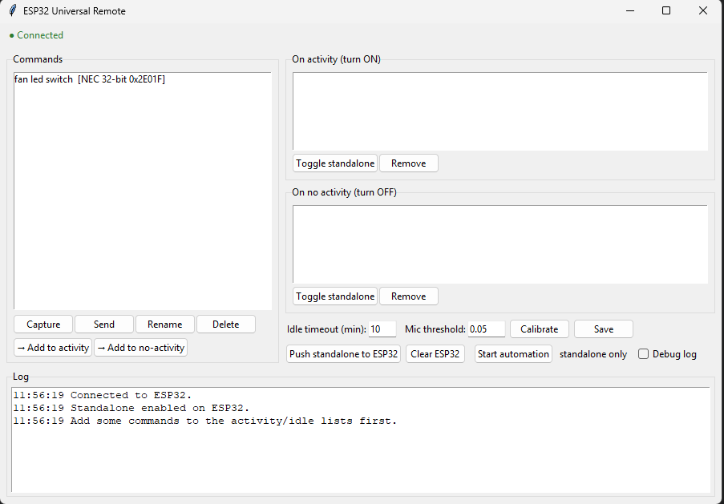

# UniIr — ESP32 Universal Remote

A DIY **universal remote**. An ESP32 captures IR commands from any
remote, stores a command library, and replays them over Bluetooth on request —
and it can run **activity-based automation** on its own: turn your gear on when
there's activity in the room and off again after a period of quiet.

It ships as three parts:

- **Firmware** for the ESP32 (`UniIR.ino`).
- **`UniIr`** — a small Python library that controls the device over its
  Bluetooth/USB serial link (`__init__.py`).
- **A demo GUI** (`demo.py`) that uses the library — capture, replay, organise a
  command library, and configure automation.

It also includes a parametric **3D-printable enclosure** (`UniIR.scad`).

---

## Screenshots

### Circuit / wiring diagram


### 3D-printed enclosure


### Demo GUI


## Table of contents

1. [What it does](#what-it-does)
2. [Project structure](#project-structure)
3. [Hardware](#hardware)
4. [The IR LED driver](#the-ir-led-driver)
5. [3D-printed case](#3d-printed-case)
6. [Firmware](#firmware)
7. [The `UniIr` library](#the-uniir-library)
8. [The demo GUI](#the-demo-gui)
9. [How automation works](#how-automation-works)
10. [macOS Bluetooth notes & troubleshooting](#macos-bluetooth-notes--troubleshooting)
11. [Serial protocol reference](#serial-protocol-reference)

---

## What it does

- **Capture** IR commands from any remote — ordinary remotes (NEC, Sony, RC5,
  etc.), **stateful air-conditioner** remotes (the whole state frame is captured
  and replayed verbatim, so there's no model-lockup risk), and unknown signals
  as **raw** timing.
- **Replay** any stored command on demand.
- **Activity automation** — fuse keyboard, mouse, microphone loudness and a PIR
  motion sensor into a single "active / idle" signal. When activity resumes it
  fires your *on* commands; after a configurable idle timeout it fires your *off*
  commands.
- **Standalone mode** — the ESP32 stores a copy of the automation and keeps
  running it even when the PC is asleep or the app is closed.
- **Self-healing connection** — the library auto-reconnects, verifies the link
  with a handshake, and survives the device resetting (handled carefully because
  macOS Bluetooth serial is fussy about stale links).

---

## Project structure

```
UniIr/
├── __init__.py            # the UniIr library (device client + automation runner)
├── demo.py                # tkinter demo GUI built on the library
├── UniIR.ino              # ESP32 firmware (Arduino)
├── case/                  # parametric enclosure (OpenSCAD)
├── images/                
└── README.md
```

---

## Hardware

### Bill of materials

| Qty | Part | Notes |
|----:|------|-------|
| 1 | ESP32 DevKit (30-pin DOIT / WROOM-32) | has built-in Classic Bluetooth |
| 1 | KY-022 IR receiver module | the "eye" that captures remotes |
| 1 | HC-SR501 PIR motion sensor | the big white dome |
| 1 | S8050 NPN transistor | switches the IR LEDs (TO-92) |
| 4 | IR LED, 940 nm, 5 mm | the IR "blasters" |
| 2 | 22 Ω resistor, ¼ W | one per LED branch |
| 1 | 220 Ω resistor, ¼ W | transistor base |
| 1 | 10 kΩ resistor, ¼ W | base pull-down |
| 1 | USB cable + 5 V supply | powers everything |
| — | jumper wires, 3D-printed case | — |

### Pin connections

| ESP32 pin | Connects to | Purpose |
|-----------|-------------|---------|
| **GPIO35** (D35) | KY-022 **S** (signal out) | IR receive (input-only pin) |
| **GPIO34** (D34) | HC-SR501 **OUT** | PIR motion (input-only pin) |
| **GPIO32** (D32) | 220 Ω → S8050 **base** | IR transmit |
| **3V3** | KY-022 **+ (VCC)** | receiver power |
| **VIN (5V)** | HC-SR501 **VCC**, LED driver **+** | from USB |
| **GND** | all GND, S8050 **emitter**, 10 kΩ | common ground |

> GPIO34 and GPIO35 are **input-only** pins — perfect for the two sensors, and
> they can't accidentally be driven as outputs.

Everything is powered from the ESP32's USB connector; the 5 V for the PIR and the
LED array is taken from the **VIN** pin.

---

## The IR LED driver

A GPIO pin can only source a few milliamps — nowhere near enough to drive IR LEDs
to useful range. So the four LEDs are driven by an **S8050 transistor** in a
**2S2P** arrangement (two parallel branches, each two LEDs in series):

```
              +5V (VIN)
                │
        ┌───────┴───────┐
       22Ω             22Ω
        │               │
       LED             LED
        │               │
       LED             LED
        │               │
        └───────┬───────┘
                │ (collector)
            [ S8050 ]  ── base ── 220Ω ── GPIO32
                │ (emitter)        │
               GND              10kΩ → GND
```

- Each 22 Ω resistor sets ~85–100 mA per branch (~200 mA total).
- The 220 Ω feeds the base; the 10 kΩ holds the transistor off at boot.
- **S8050 pinout is E–B–C** (emitter, base, collector) with the flat face toward
  you — note it's the *reverse* of a BC547.

The firmware only pulses the LEDs during a transmit burst, so the resistors stay
cool. This is the difference between "works only if you aim it" and blasting IR
across a room.

---

## 3D-printed case

`UniIR.scad` is a **parametric** enclosure: a domed front, a flat removable
**snap-fit back door**, and a flat bottom so it sits on a desk. All the four IR
LEDs poke out of the dome (front-centre, left, right and top) for wide coverage,
the PIR dome sits on the front, and the IR receiver looks out the **top centre**.
The ESP32 clips onto four standoffs through its mounting holes.

### Printing it

1. Install [OpenSCAD](https://openscad.org).
2. Open `UniIR.scad`. Every dimension is a variable at the top — set them
   to match your parts (board size, mounting-hole spacing/diameter, etc.).
3. Set `part = "base";`, press **F6** (render), then **File → Export → STL**.
4. Set `part = "door";`, render again, export the door.
5. Slice and print — body open-side up, door laid flat. No supports needed.

Or from the command line:

```bash
openscad -o base.stl -D 'part="base"' ir_hub_case.scad
openscad -o door.stl -D 'part="door"' ir_hub_case.scad
```

**Tunable parameters worth checking first:** `esp_hole_dx` / `esp_hole_dy` /
`esp_hole_d` (your board's mounting holes), `stand_h` (standoff height — must
clear your bottom pins/connectors), `usb_z` (USB connector height), and `snap`
(back-door snap tightness). Set the HC-SR501's two trim pots **before** closing
the case — they end up facing inward.

---

## Firmware

### Toolchain

- [Arduino IDE](https://www.arduino.cc/en/software) with the **ESP32 board
  package** installed (Boards Manager → "esp32" by Espressif).
- Library: **IRremoteESP8266** (Library Manager).
- `BluetoothSerial` ships with the ESP32 core.

### Flashing

1. Open `UniIr.ino` in the Arduino IDE.
2. Select your board (e.g. "DOIT ESP32 DEVKIT V1") and the right serial port.
3. Upload. Open the Serial Monitor at **115200** to watch debug output.

The ESP32 advertises over Bluetooth as **`uniir`**. Pair it from your computer's
Bluetooth settings. On macOS it then appears as the serial device
**`/dev/cu.uniir`**; on Windows it's assigned a COM port.

---

## The `UniIr` library

### Install

```bash
pip install pyserial                       # required
pip install pynput sounddevice numpy       # only needed to RUN automation
```

### Quick start

```python
from UniIr import UniIr            # the device client class

remote = UniIr("/dev/cu.uniir",       # or "COM$" on Windows
            on_status=lambda up: print("connected" if up else "disconnected"),
            on_log=print)

# Capture a button — press the remote when your own UI prompts the user
cmd = remote.capture()                # -> a command dict, or None on timeout
if cmd:
    remote.send(cmd)                  # replay it (blocks until the ESP32 confirms)

# Stream motion events
remote.pir_handler = lambda line: print("motion!" if line == "PIR 1" else "still")

remote.close()
```

The connection is **managed for you**: constructing `UniIr(...)` starts
background threads that open the port, verify it with a handshake, watch a
heartbeat, and reconnect automatically. `remote.connected` is `True` only after a
verified link.

### API reference

**`UniIr(port, baud=115200, on_status=None, on_log=None, auto_connect=True)`**

| Method | Description |
|--------|-------------|
| `capture(timeout=25)` | Capture the next IR signal → command dict or `None` |
| `send(cmd)` | Replay a command, blocking until confirmed → `bool` |
| `send_async(cmd)` | Fire a code/state command without waiting (for automation) |
| `provision(activity_specs, idle_specs, timeout_sec)` | Store standalone automation on the ESP32 → `(ok, where)` |
| `set_standalone(enabled)` | Turn the ESP32's standalone mode on/off |
| `clear_standalone()` | Erase standalone commands from the ESP32 |
| `ping(timeout=3)` | `True` if the device answers |
| `close()` | Stop threads and release the port |

| Attribute | Description |
|-----------|-------------|
| `connected` | `True` after a verified handshake |
| `pir_handler` | Set to `f(line)` to receive `"PIR 1"` / `"PIR 0"` motion lines |
| `on_status`, `on_log` | Callbacks (also settable in the constructor) |

### Command data model

A command is a plain `dict`, one of three shapes:

```python
{"type": "code",  "proto": 3, "name": "TV_power", "bits": 32, "value": "20df10ef"}
{"type": "state", "proto": 18, "name": "AC_cool", "nbytes": 3, "bytes": ["a1","b2","c3"]}
{"type": "raw",   "name": "RAW", "data": [9000, 4500, 560, 560, ...]}
```

Helper functions: `describe(cmd)` (human-readable string), `to_spec(cmd)`
(encode for the ESP32; raises for raw), `is_storable(cmd)` (can it run
standalone?).

### Storage helpers

```python
from UniIr import load_data, save_data

data = load_data()                 # -> {"commands": {...}, "automation": {...}}
data["commands"]["tv_power"] = cmd
save_data(data)                    # writes commands.json
```

### Command-line connectivity test

```bash
python -m UniIr            # if installed as a package
# or, from inside the folder:
python __init__.py --port /dev/cu.uniir
```

---

## The demo GUI

`demo.py` is a tkinter app that exercises the whole library. Run it:

```bash
python -m UniIr.demo                 # from the parent folder (recommended)
# or, from inside the UniIr folder:
python demo.py --port /dev/cu.uniir
```

On macOS the default port is `/dev/cu.uniir`, so you can usually omit `--port`.

### What it does

- **Command library** — capture, send, rename and delete IR commands; everything
  is saved to `commands.json`.
- **Automation lists** — add commands to an **On activity** list (fired when
  activity resumes) and an **On no activity** list (fired after the idle
  timeout). Mark commands "standalone" to also store them on the ESP32.
- **Settings** — idle timeout (minutes), microphone threshold, and a
  **Calibrate** button that measures ambient noise and sets a sensible threshold.
- **Push standalone to ESP32 / Clear ESP32** — provision or wipe the device's
  own copy of the automation.
- **Start / Stop automation** and a **Debug log** toggle (see below).
- **Connection status** — a live ● Connected / ● Disconnected indicator and a
  timestamped log.

### macOS permissions

To *run* automation, the OS must allow the Python process to watch input and the
mic:

- **System Settings → Privacy & Security → Microphone** → allow Python/Terminal.
- **System Settings → Privacy & Security → Input Monitoring** → allow
  Python/Terminal.

---

## How automation works

The idea is simple: **activity = devices on, sustained quiet = devices off.**

- The PC runner fuses four signals — **keyboard**, **mouse**, **microphone
  loudness**, and **PIR motion** from the ESP32. Any of them counts as activity.
- When automation starts it **assumes the devices are already on** and begins the
  idle countdown immediately.
- When activity resumes after being idle, it fires the **On activity** commands.
- After `timeout` seconds with no activity from any source, it fires the **On no
  activity** commands.

### Persisted on/off state

Automation has a single saved intent (`enabled` in `commands.json`):

- **First ever launch** → on by default; it starts as soon as the device
  connects.
- After that, the stored state is used and **synced to the ESP32** on every
  connect.
- **Disconnecting stops automation** (it needs the device), and it can only be
  enabled while connected. On reconnect it resumes to the stored state.

### Standalone mode

If you "push standalone to ESP32", the device keeps a copy of your *activity* and
*idle* command lists plus the timeout. When the PC's heartbeat stops (app closed,
laptop asleep), the ESP32 takes over using the PIR sensor alone — so the room
automation keeps working with the computer off.

### Debug mode

Tick **Debug log** to see exactly what's keeping the system awake — useful for
tuning the timeout. With it on, the log shows (tagged `[debug]`):

- `timer reset by keyboard / mouse / sound / motion` every time activity restarts
  the countdown (high-rate sources throttled so they don't flood the log),
- `quiet for Ns — off in Ms` every few seconds while devices are on,
- each command fired, by name, and PIR clear events.

If your gear keeps staying on, debug usually reveals the mic threshold is too low
(catching background noise) or the PIR is re-triggering.

---

## macOS Bluetooth notes & troubleshooting

macOS Bluetooth serial (SPP) is more finicky than Windows. The firmware and
library work around the common issues:

- **"Connected" but nothing happens.** macOS can open a stale port that carries
  no data. The library only reports *Connected* after a **PING/PONG handshake**,
  so a dead link shows as Disconnected and keeps retrying.
- **Won't reconnect after the ESP32 resets without re-pairing.** macOS often
  doesn't tear down the old session. The firmware now **drops its Bluetooth
  client** when the PC's heartbeat stops (~12 s), forcing a fresh session so the
  app reconnects on its own — no re-pair needed.
- **Reconnect detection.** The ESP32 answers each heartbeat with `HBOK`; if the
  library hears nothing for 12 s it declares the link dead and reconnects.

If it still won't reconnect, remove "uniir" in **Bluetooth settings** and pair it
again. On Windows none of this applies — just pass the right `--port COMx`.

---

## Serial protocol reference

All lines are newline-terminated ASCII at 115200 baud.

| Direction | Line | Meaning |
|-----------|------|---------|
| → | `PING` / `HB` | liveness probe / heartbeat |
| ← | `PONG` / `HBOK` | replies |
| → | `CAP` | capture the next IR signal |
| ← | `CODE <proto> <name> <bits> <hex>` | captured a normal remote |
| ← | `STATE <proto> <name> <nbytes> <bytes…>` | captured a stateful (AC) remote |
| ← | `RAW <len> <µs…>` | captured an unknown signal |
| → | `SEND CODE …` / `SEND STATE …` | replay a command |
| → | `LOADRAW <n>` → `D <values…>` → `FIRE` | replay a raw command |
| → | `AUTOCFG <sec>` / `AUTOACT <spec>` / `AUTOIDLE <spec>` / `AUTOSAVE` | provision standalone |
| → | `AUTOEN 1\|0` / `AUTOCLEAR` | enable/disable / wipe standalone |
| ← | `PIR 1` / `PIR 0` | async motion start / stop |
| ← | `ACK` / `SENT` / `TIMEOUT` | acknowledgements |

---
